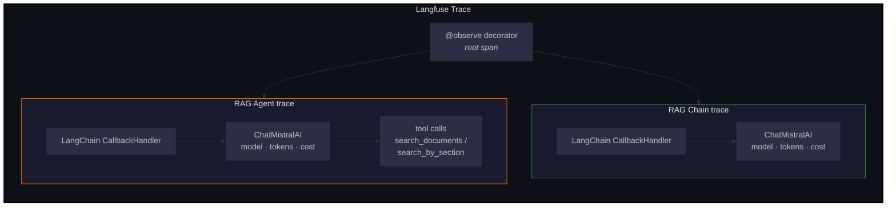
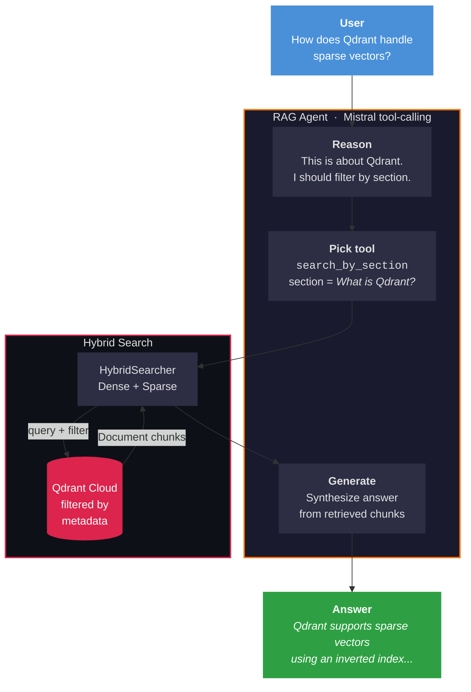
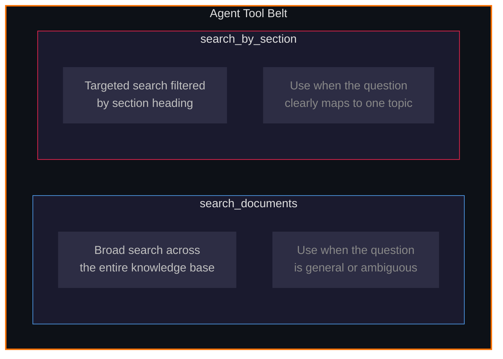
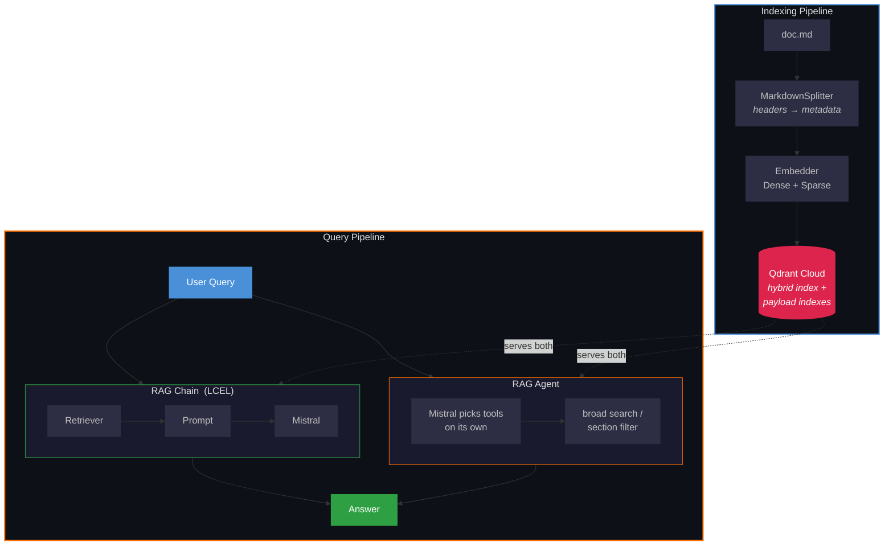
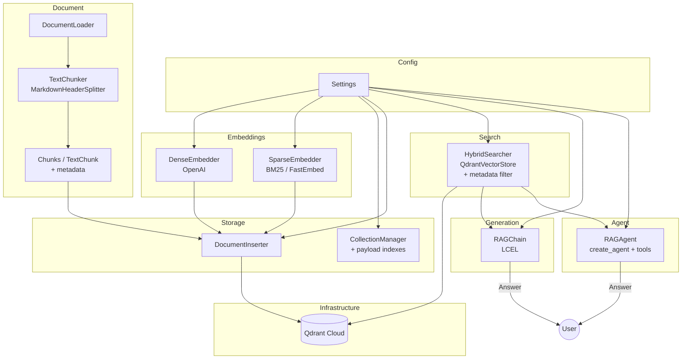
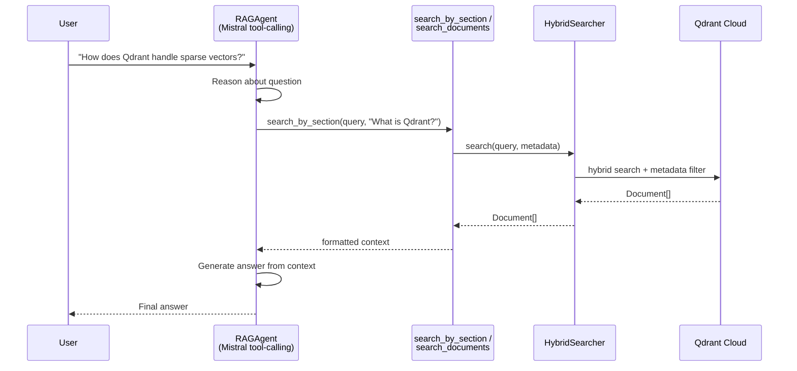
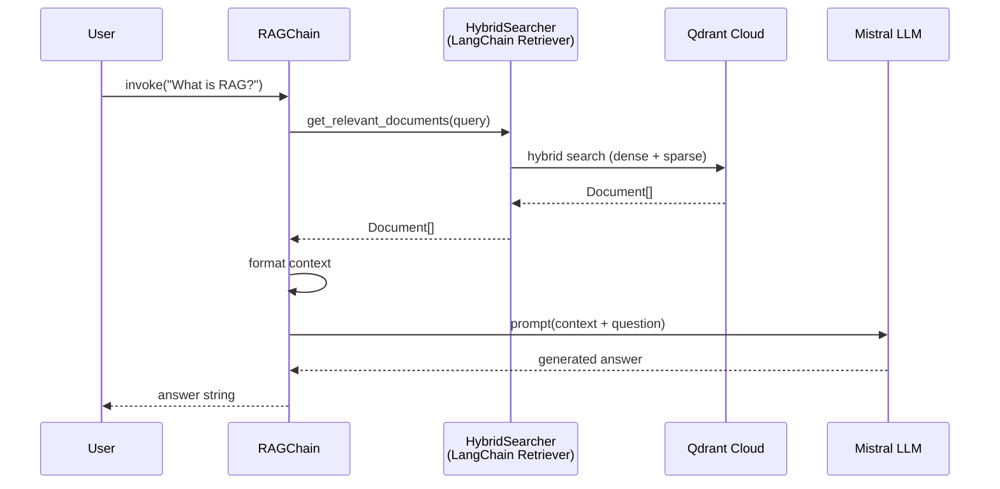
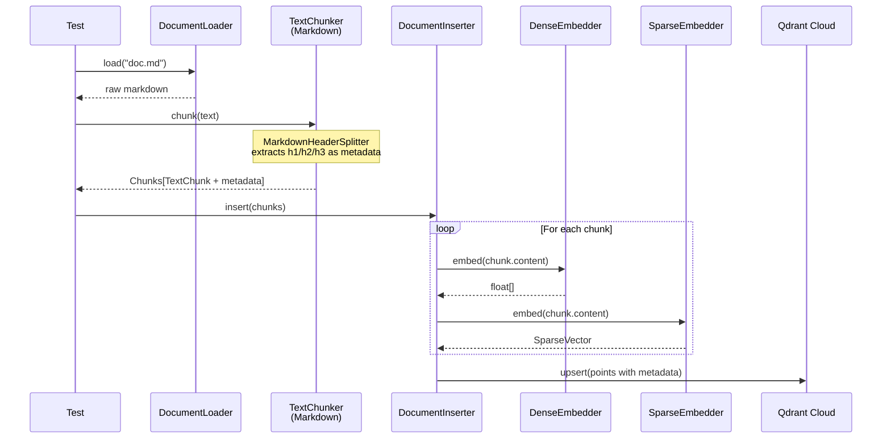

# RAG Hybrid Search

```
██████╗  █████╗  ██████╗
██╔══██╗██╔══██╗██╔════╝
██████╔╝███████║██║  ███╗
██╔══██╗██╔══██║██║   ██║
██║  ██║██║  ██║╚██████╔╝
╚═╝  ╚═╝╚═╝  ╚═╝ ╚═════╝

  Hybrid Search · Agentic RAG · Retrieval-Augmented Generation
```

> A clean, **Object Calisthenics**-driven RAG system featuring an **autonomous agent**
> that combines **dense (OpenAI)** and **sparse (BM25)** hybrid retrieval in Qdrant Cloud
> with **Mistral** as the generation LLM — fully orchestrated by LangChain.

      

---

## Observability with Langfuse

Every execution — chain or agent — is **fully traced** in [Langfuse](https://langfuse.com), capturing latency, token usage, cost, and model name per call.



What is captured per trace:

| Signal | RAG Chain | RAG Agent |
|---|---|---|
| Root span + tags | ✅ `chain` | ✅ `agent` |
| Model name | ✅ | ✅ |
| Prompt & completion tokens | ✅ | ✅ |
| Cost | ✅ | ✅ |
| Tool calls & results | — | ✅ |
| Latency (end-to-end) | ✅ | ✅ |

> **Live trace →** <a href="https://us.cloud.langfuse.com/project/cmlxvbg68071ead07jrhkqnfp/traces/847d3f4286cb7a58357a65e0afec63d8?timestamp=2026-02-22T15:18:57.880Z" target="_blank">RAG Agent · "How does Qdrant handle sparse vectors?"</a>

---

## Two Modes of RAG

This project ships with **two approaches** to the "G" in RAG:


| Mode          | Description                                                                                                                     |
| ------------- | ------------------------------------------------------------------------------------------------------------------------------- |
| **RAG Chain** | Deterministic LCEL pipeline: retrieve → prompt → generate. Simple, predictable, fast.                                           |
| **RAG Agent** | Autonomous tool-calling agent that **decides on its own** whether to search broadly or filter by document section via metadata. |


---

## The Agent in Action




The agent has **two tools** at its disposal and picks the right one per query:




---

## Full Pipeline




---

## Architecture




---

## Agent Flow (Tool-Calling)




---

## RAG Chain Flow (LCEL)




---

## Indexing Flow




---

## Project Structure

```
rag-hybrid-search-multi-query/
│
├── doc.md                         ← source Markdown document to index
├── test_rag.py                    ← end-to-end test suite (7 tests)
├── requirements.txt
├── .env                           ← API keys & config
│
└── src/
    ├── config/
    │   └── Settings.py            ← single source of truth for env vars
    │
    ├── document/
    │   ├── DocumentLoader.py      ← reads raw text from file
    │   └── TextChunker.py         ← MarkdownHeaderSplitter + metadata
    │
    ├── embeddings/
    │   ├── DenseEmbedder.py       ← OpenAI text-embedding-3-small
    │   └── SparseEmbedder.py      ← BM25 via FastEmbed
    │
    ├── storage/
    │   ├── CollectionManager.py   ← create / delete collections + payload indexes
    │   └── DocumentInserter.py    ← build PointStructs with metadata and upsert
    │
    ├── search/
    │   └── HybridSearcher.py      ← QdrantVectorStore (hybrid + metadata filter)
    │
    ├── generation/
    │   └── RAGChain.py            ← LCEL chain: retriever → Mistral → answer
    │
    └── agent/
        └── RAGAgent.py            ← autonomous agent with search tools
```

---

## Object Calisthenics Applied


| Rule                     | How It Is Applied                                                            |
| ------------------------ | ---------------------------------------------------------------------------- |
| One level of indentation | Every method does one thing; loops delegate to helpers                       |
| No `else`                | Early returns replace every `if/else` branch                                 |
| Wrap primitives          | `TextChunk` wraps `(content, index, metadata)`                               |
| First-class collections  | `Chunks` is a dedicated class, not a plain list                              |
| One dot per line         | No chained calls across object boundaries                                    |
| No abbreviations         | `dense_embedder`, `sparse_vector`, `embedding_dimension` — always full names |
| Small entities           | Every class fits on one screen; every method under ~12 lines                 |


---

## Tech Stack

| Component | Technology |
|---|---|
| Vector DB |  |
| Dense embeddings |  |
| Sparse embeddings |  |
| Text splitting |  |
| Retriever |  |
| LLM |  |
| RAG Chain |  |
| RAG Agent |  |
| Observability |  |
| Language |  |

